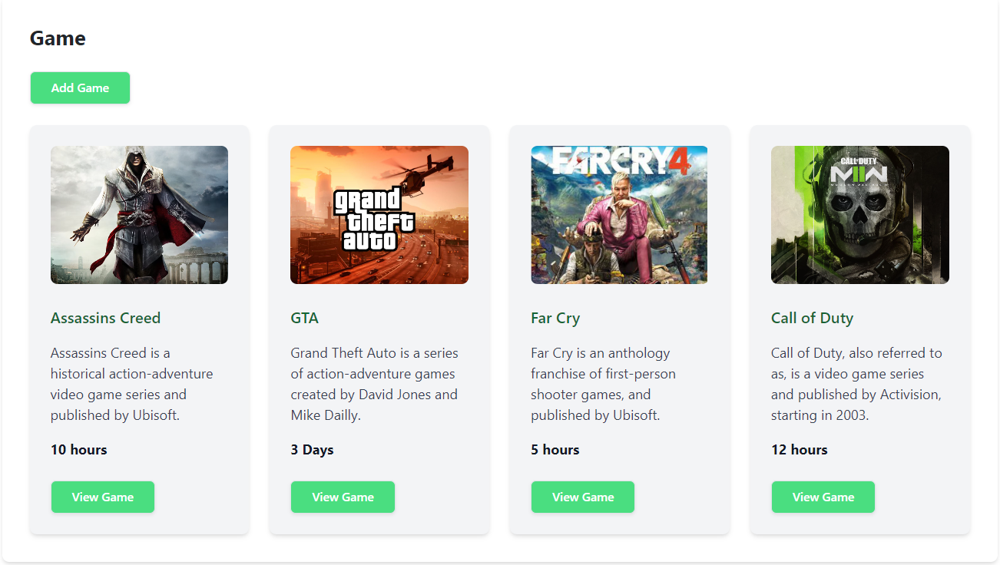
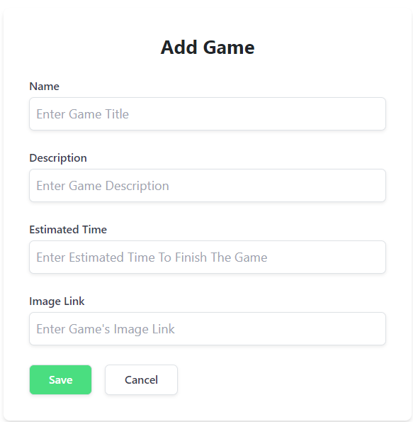
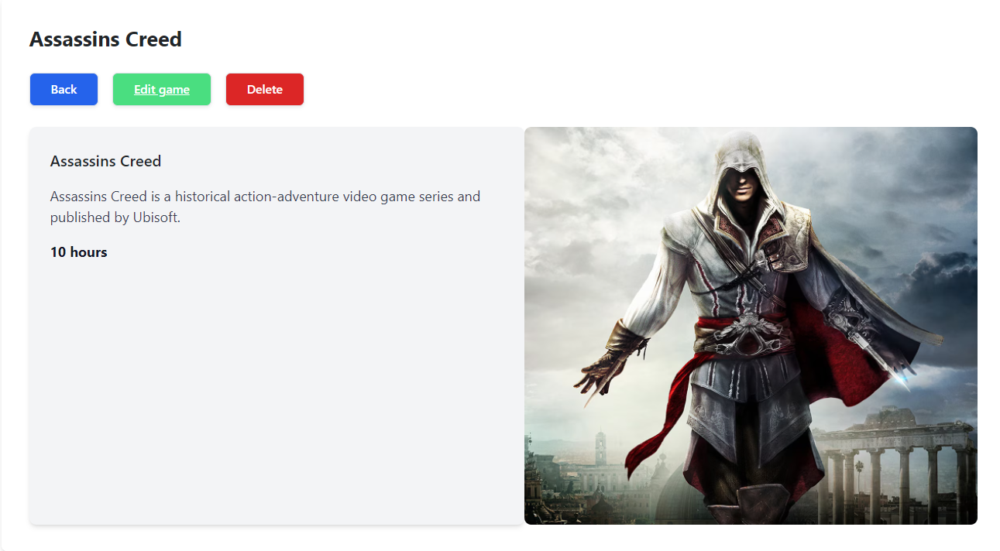

# GameStack

GameStack is a full-stack gaming platform designed to manage your favorite games efficiently. Developed using React for the front end, Express.js for the back end, and Tailwind CSS for styling, GameStack provides a seamless and visually appealing user experience.

## Features

- **Add, View, Edit, and Delete Games**: Perform CRUD operations to manage your game collection effortlessly.
- **Game Image Management**: Add game images from Google based on their links.
- **Responsive Design**: Enjoy a responsive and intuitive user interface built with Tailwind CSS.
- **RESTful APIs**: Handle game data management through well-defined RESTful APIs.

## Technologies Used

- **Front End**: React
- **Back End**: Express.js
- **Styling**: Tailwind CSS

## Screenshots

### Home Page

### Add Game

### Edit Game

## Installation

To get a local copy up and running, follow these steps.

### Prerequisites

Make sure you have Node.js and npm installed on your machine.

### Clone the Repository

**git clone https://github.com/your-username/GameStack.git
**cd GameStack
**Install Dependencies for Frontend
**cd frontend
**npm install
**Install Dependencies for Backend
**cd ../backend
**npm install
**Run the Application
**cd frontend
**npm start
### The frontend will run on http://localhost:3000.
cd backend
npm start
### The backend will run on http://localhost:5000 (or your configured port).
### API Endpoints
Here are the primary API endpoints used in GameStack:

GET /api/games: Retrieve a list of all games.
POST /api/games: Add a new game.
GET /api/games/
: Retrieve details of a specific game by ID.
PUT /api/games/
: Update details of a specific game by ID.
DELETE /api/games/
: Delete a specific game by ID.
Usage
Home Page: View the list of games in your collection.
Add Game: Use the form to add new games to your collection.
Edit Game: Edit existing game details.
Delete Game: Remove games from your collection.
